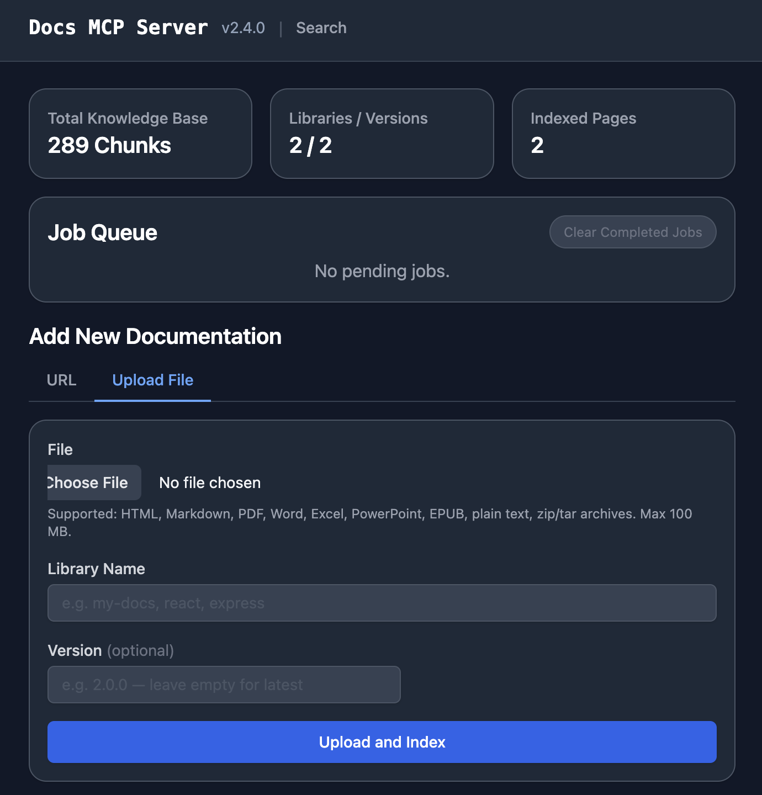

# Grounded Docs: Your AI's Up-to-Date Documentation Expert

> **This is a personal fork of [arabold/docs-mcp-server](https://github.com/arabold/docs-mcp-server).** Telemetry is disabled by default — no usage data is sent anywhere. Run from source after `npm run build`.

**Docs MCP Server** solves the problem of AI hallucinations and outdated knowledge by providing a personal, always-current documentation index for your AI coding assistant. It fetches official docs from websites, GitHub, npm, PyPI, and local files, allowing your AI to query the exact version you are using.



## ✨ Why Grounded Docs MCP Server?

The open-source alternative to **Context7**, **Nia**, and **Ref.Tools**.

-   ✅ **Up-to-Date Context:** Fetches documentation directly from official sources on demand.
-   🎯 **Version-Specific:** Queries target the exact library versions in your project.
-   💡 **Reduces Hallucinations:** Grounds LLMs in real documentation.
-   🔒 **Private & Local:** Runs entirely on your machine; your code never leaves your network.
-   🧩 **Broad Compatibility:** Works with any MCP-compatible client (Claude, Cline, etc.).
-   📁 **Multiple Sources:** Index websites, GitHub repositories, local folders, and zip archives.
-   📄 **Rich File Support:** Processes HTML, Markdown, PDF, Office documents (Word, Excel, PowerPoint), OpenDocument, RTF, EPUB, Jupyter Notebooks, and [90+ source code languages](docs/concepts/supported-formats.md).

---

## 📄 Supported Formats

| Category | Formats |
|----------|---------|
| **Documents** | PDF, Word (.docx/.doc), Excel (.xlsx/.xls), PowerPoint (.pptx/.ppt), OpenDocument (.odt/.ods/.odp), RTF, EPUB, FictionBook, Jupyter Notebooks |
| **Archives** | ZIP, TAR, gzipped TAR (contents are extracted and processed individually) |
| **Web** | HTML, XHTML |
| **Markup** | Markdown, MDX, reStructuredText, AsciiDoc, Org Mode, Textile, R Markdown |
| **Source Code** | TypeScript, JavaScript, Python, Go, Rust, C/C++, Java, Kotlin, Ruby, PHP, Swift, C#, and [many more](docs/concepts/supported-formats.md#source-code) |
| **Data** | JSON, YAML, TOML, CSV, XML, SQL, GraphQL, Protocol Buffers |
| **Config** | Dockerfile, Makefile, Terraform/HCL, INI, dotenv, Bazel |

See **[Supported Formats](docs/concepts/supported-formats.md)** for the complete reference including MIME types and processing details.

---

## 🚀 Quick Start

### CLI First

For agents and scripts, the CLI is usually the simplest way to use Grounded Docs.

First, ensure you're on Node.js 22 (install [nvm](https://github.com/nvm-sh/nvm) if you haven't already), then build:

```bash
nvm use
npm run build
```

**1. Index documentation:**

```bash
node dist/index.js scrape react https://react.dev/reference/react
```

For hash-routed SPA docs sites, enable hash preservation explicitly:

```bash
node dist/index.js scrape my-spa https://docs.example.com/#/guide --preserve-hashes
```

**2. Query the index:**

```bash
node dist/index.js search react "useEffect cleanup" --output yaml
```

**3. Fetch a single page as Markdown:**

```bash
node dist/index.js fetch-url https://react.dev/reference/react/useEffect
```

### Output Behavior

- Structured commands default to clean JSON on stdout in non-interactive runs.
- Use `--output json|yaml|toon` to pick a structured format.
- Plain-text commands such as `fetch-url` keep their text payload on stdout.
- Diagnostics go through the shared logger and are kept off stdout in non-interactive runs.
- Use `--quiet` to suppress non-error diagnostics or `--verbose` to enable debug output.

### Agent Skills

The [`skills/`](skills/) directory contains [Agent Skills](https://agentskills.io) that teach AI coding assistants how to use the CLI — covering documentation search, index management, and URL fetching.

### MCP Server

If you want a long-running MCP endpoint for Claude, Cline, Copilot, Gemini CLI, or other MCP clients:

**1. Start the server** (after `npm run build`):

```bash
npm start
```

**2. Open the Web UI** at **[http://localhost:6280](http://localhost:6280)** to add documentation.

**3. Connect your AI client** by adding this to your MCP settings (e.g., `claude_desktop_config.json`):

```json
{
  "mcpServers": {
    "docs-mcp-server": {
      "type": "sse",
      "url": "http://localhost:6280/sse"
    }
  }
}
```

See **[Connecting Clients](docs/guides/mcp-clients.md)** for VS Code (Cline, Roo) and other setup options.

`scrape_docs` also accepts `preserveHashes: true` for documentation sites that use hash-based client-side routing.
Use it only for hash-routed SPAs; normal sites typically use hash fragments for in-page anchors.

<details>
<summary>Alternative: Run with Docker</summary>

```bash
docker run --rm \
  -v docs-mcp-data:/data \
  -v docs-mcp-config:/config \
  -p 6280:6280 \
  ghcr.io/arabold/docs-mcp-server:latest \
  --protocol http --host 0.0.0.0 --port 6280
```

</details>

### 🧠 Configure Embedding Model (Recommended)

Using an embedding model is **optional** but dramatically improves search quality by enabling semantic vector search.

**Example: Enable OpenAI Embeddings**

```bash
OPENAI_API_KEY="sk-proj-..." npm start
```

See **[Embedding Models](docs/guides/embedding-models.md)** for configuring **Ollama**, **Gemini**, **Azure**, and others.

---

## 📚 Documentation

### Getting Started
-   **[Installation](docs/setup/installation.md)**: Detailed setup guides for Docker, Node.js, and Embedded mode.
-   **[Connecting Clients](docs/guides/mcp-clients.md)**: How to connect Claude, VS Code (Cline/Roo), and other MCP clients.
-   **[Basic Usage](docs/guides/basic-usage.md)**: Using the Web UI, CLI, and scraping local files.
-   **[Configuration](docs/setup/configuration.md)**: Full reference for config files and environment variables.
-   **[Supported Formats](docs/concepts/supported-formats.md)**: Complete file format and MIME type reference.
-   **[Embedding Models](docs/guides/embedding-models.md)**: Configure OpenAI, Ollama, Gemini, and other providers.
-   **[Search Quality Benchmark](docs/guides/benchmarking.md)**: Measure retrieval quality with IR metrics + LLM-judged scores; prerequisites, how to run, how to interpret results.

### Hash-Routed SPAs
-   Use `--preserve-hashes`, MCP `preserveHashes`, or the Web UI "Preserve Hash Routes" checkbox only for docs sites that route with URLs like `#/guide`.
-   When enabled with `scrapeMode=fetch`, the scraper automatically upgrades the job to Playwright because plain fetch cannot evaluate client-side hash routes.
-   Refresh reuses the stored `preserveHashes` setting by default, and CLI/Web refresh entrypoints can override it explicitly.

### Markdown-Optimized Web Scraping
-   Web scrapes and refreshes automatically probe for `llms.txt` at the documentation subpath and site root before normal crawling. When found, the curated links become additional crawl seeds, and pages discovered this way prefer `.md` URL variants such as `/guide/index.html.md` or `/page.html.md` before falling back to the original page.
-   Web requests send `Accept: text/markdown, text/html;q=0.9, */*;q=0.8` by default. Servers that support Markdown content negotiation, including Cloudflare Markdown for Agents, can return Markdown directly so the scraper bypasses HTML-to-Markdown conversion for cleaner output.
-   This behavior is automatic and requires no configuration. Custom `Accept` headers are preserved when provided.

### Key Concepts & Architecture
-   **[Deployment Modes](docs/infrastructure/deployment-modes.md)**: Standalone vs. Distributed (Docker Compose).
-   **[Authentication](docs/infrastructure/authentication.md)**: Securing your server with OAuth2/OIDC.
-   **[Security](docs/infrastructure/security.md)**: Trust boundaries, deployment hardening, and outbound access controls.
-   **[Telemetry](docs/infrastructure/telemetry.md)**: Privacy-first usage data collection.
-   **[Architecture](ARCHITECTURE.md)**: Deep dive into the system design.

---

## 🤝 Contributing

We welcome contributions! Please see **[CONTRIBUTING.md](CONTRIBUTING.md)** for development guidelines and setup instructions.

## License

This project is licensed under the MIT License. See [LICENSE](LICENSE) for details.
